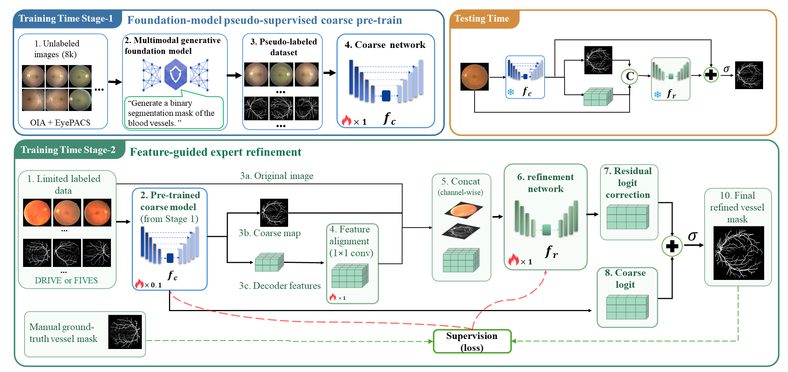

# Foundation-Model-Guided Coarse-to-Fine Learning for Generalizable Retinal Vessel Segmentation
This repository contains the official PyTorch implementation for our BMVC submission.
## Overview

**Our Proposed Coarse-to-Fine Framework:**


## 1. Environment Setup

Please ensure you have Python 3.8+ installed. Install the required dependencies:

```bash
pip install -r requirements.txt

```

## 2. Project Structure

* `train.py`: Contains the definition of the Two-Stage UNet, dataset loaders, and the training loop for both Stage 1 (Pseudo-supervised Pre-training) and Stage 2 (Expert Refinement).
* `test.py`: Inference script to evaluate the trained model on cross-domain datasets and compute region overlap (Dice) as well as topology metrics (clDice, HD95).
* `data/`: Contains a small subset of sample pairs (original images, manual ground truths, and foundation-model-generated pseudo-masks) for quick verification of the dataset loading logic.
* `checkpoints/`: Directory intended for pre-trained model checkpoints.

## 3. Data & Pre-trained Weights (Google Drive)

Please note that the data included in this repository is for **demonstration purposes only** to help reviewers quickly verify the code logic.

Due to file size limits, the complete dataset and the full pre-trained model weights are hosted on Google Drive. To ensure full transparency and reproducibility, you can download them here:

* **[Google Drive Link Here]**

**Contents of the Google Drive:**

* **8k Auxiliary Dataset**: The full pool of unlabeled fundus images along with their generated pseudo-masks (to be placed in the `data/` directory).
* **Pre-trained Models**: The final Stage 2 model weights (e.g., `best_stage2_model.pth`). Please place the downloaded `.pth` files into the `checkpoints/` folder. You can then directly run `test.py` to reproduce the quantitative results reported in our main paper.

## 4. Pseudo-label Generation Protocol

As described in Section 3.2 of the paper, our Stage 1 relies on pseudo-masks generated by a multimodal generative foundation model. Since this was a one-time offline data generation process, it was conducted directly via the foundation model interface (Gemini Nano Banana, model version: `gemini-2.5-flash-image`).

To ensure full transparency and reproducibility, we provide the exact text prompt used for all 8k images:

> **Text Prompt:** "Generate a binary segmentation mask of the blood vessels, ensuring the vessels are solid (no hollow or broken interiors)."

**Workflow:**

1. An unlabeled fundus image was fed into the model.
2. The exact text prompt above was provided (requiring no manual spatial prompts). We used one query per image with a top-k sampling of 1 and a fixed binarization threshold of 0.5.
3. The raw output mask was converted to a one-channel binary pseudo-mask and directly used for Stage 1 pre-training. No morphology-based clean-up or connected-component filtering was applied.

## 5. How to Run

### Training

To train the model from scratch on your own dataset, adjust the `ORIGINAL_DATA_PATHS` in the `CFG` class within `train.py`, and run:

```bash
python train.py

```

The script will automatically handle the multi-dimensional feature fusion and the joint optimization process.

### Inference (Testing)

To use the provided pre-trained checkpoint, download it from the Google Drive link, place it in the `checkpoints/` directory, update the `MODEL_PATH` in `test.py`, and run:

```bash
python test.py

```

The script will output the per-image macro metrics and save the predicted binary masks along with red-overlay visualizations in the `test_predict_vis/` directory.


```

```

```
